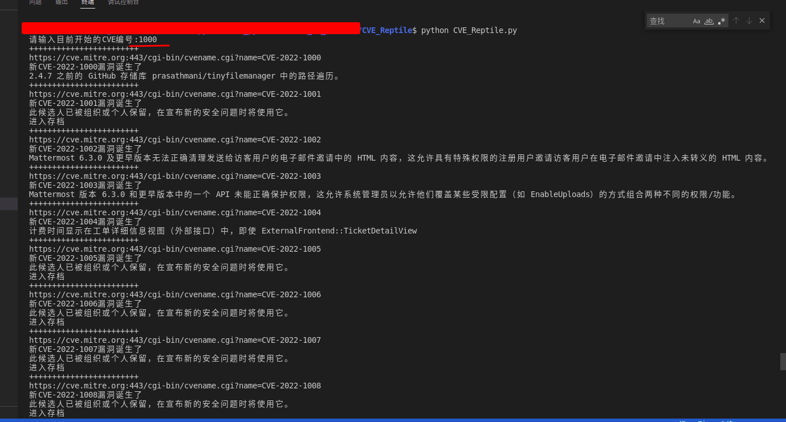
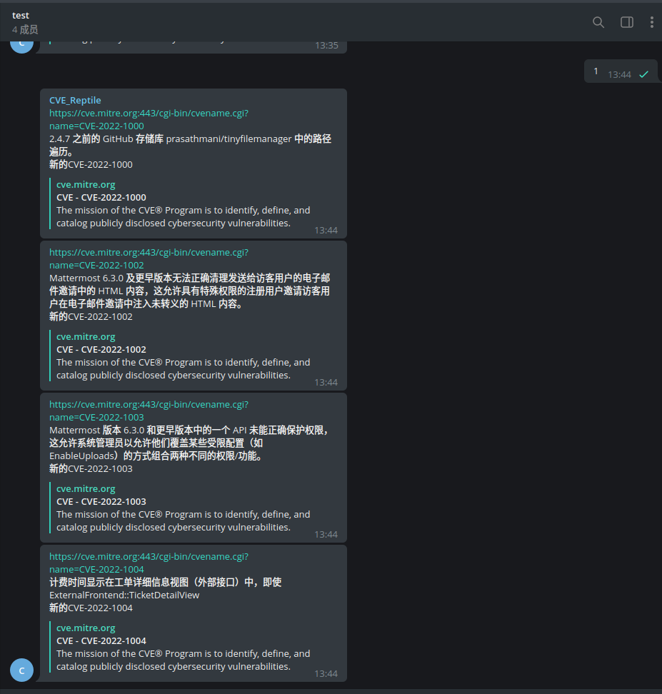
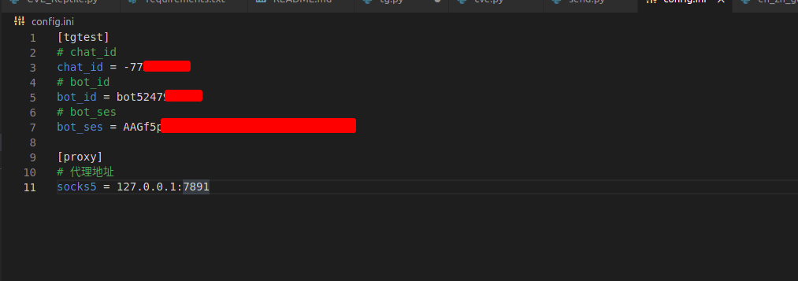

# CVE_Reptile
> 一个失败的CVE爬虫案例，因为CVE编号并不是我想象的连续的,虽然他是失败的，希望也有他的意义。

## 功能
- 爬取CVE官网
- 提取需要字段
- 翻译提取字段
- 发送tg提醒

## 效果

## 配置文件

> 拓展：ID的获取[telegram自动发信息_创建telegram 机器人 并发送消息](https://blog.csdn.net/weixin_36073714/article/details/113545113?ops_request_misc=%257B%2522request%255Fid%2522%253A%2522164818932216782246454520%2522%252C%2522scm%2522%253A%252220140713.130102334.pc%255Fall.%2522%257D&request_id=164818932216782246454520&biz_id=0&utm_medium=distribute.pc_search_result.none-task-blog-2~all~first_rank_ecpm_v1~rank_v31_ecpm-1-113545113.142%5Ev5%5Epc_search_result_cache,143%5Ev6%5Eregister&utm_term=telegram%E6%9C%BA%E5%99%A8%E4%BA%BA%E8%AE%BE%E7%BD%AE%E8%87%AA%E5%8A%A8%E5%9B%9E%E5%A4%8D&spm=1018.2226.3001.4187)
